# Haoming Koo

**Forward Deployed AI Engineer**

Production LLM systems, agentic workflows, enterprise deployments | AI Singapore | Ex-Micron ($600M+ impact) | MSc NUS

---

## What I'm Working On

- Building production ML systems at **AI Singapore (AIAP)** &mdash; computer vision, sequence modelling, NLP
- Deploying **LLM pipelines, RAG systems, and agentic workflows** into enterprise environments
- Shipping [7 live applications](https://kooexperience.com) that solve real problems &mdash; from AI-powered job matching to automated wine price intelligence

Previously led global AI-enabled transformation at **Micron Technology** for 7+ years, aligning 3,000+ engineers across four fabs and driving $600M+ in business impact. Co-led LPDDR5X and HBM3E product ramps.

## Tech Stack

**ML & AI**\

**Web & APIs**\

**Infrastructure & MLOps**\

## Live Apps

| Project | Description | Stack |
|---------|-------------|-------|
| [**Job Hunter SG**](https://job.kooexperience.com) | AI job search & resume coach for Singapore. 7-stage pipeline, 5 validation gates, RAG matching | FastAPI, React, SEA-LION, RAG |
| [**Trader Koo**](https://trader.kooexperience.com) | S&P 500 AI dashboard with YOLOv8 chart-pattern detection and candle signals | FastAPI, YOLOv8, Plotly |
| [**LionWeather**](https://lionweather.kooexperience.com) | Singapore weather intelligence with ML rainfall forecasting and SHAP analysis | React, LightGBM, Leaflet |
| [**Preflight**](https://preflight.kooexperience.com) | Upload CSV/Parquet for instant EDA, data health checks, and baseline ML | Dash, scikit-learn, Plotly |
| [**Photo Compliance Studio**](https://studio.kooexperience.com) | Passport-photo compliance checks with country rules and guided corrections | MediaPipe, OpenCV, FastAPI |
| [**Wine Intelligence**](https://wine.kooexperience.com) | Automated wine price comparison with Vivino ratings, deal scoring, and data validation pipeline | Selenium, Gemini AI, Brave API, FastAPI |

## GitHub Stats

## Latest Blog Posts

**Building**
- [I Built an AI Wine Deal Finder — Here's What 50 Bottles Taught Me](https://kooexperience.com/blog/posts/minmax-wine.html) — Brave API, Gemini grounding, data validation pipeline
- [Building Job Hunter SG — AI Resume Coaching for Singapore](https://kooexperience.com/blog/posts/job-hunter.html) — 7-stage pipeline, 5 validation gates, SEA-LION AI
- [What Mood Is the Market In? HMM Regime Detection](https://kooexperience.com/blog/posts/hmm-regime.html) — Interactive HMM walkthrough with live visualizations
- [How 468 Facial Landmarks Decide If You're Passport-Ready](https://kooexperience.com/blog/posts/photo-id-studio.html) — MediaPipe, compliance checks, 6 countries
- [How I Built an AI-Powered Stock Market Dashboard](https://kooexperience.com/blog/posts/trader-koo.html) — YOLOv8 chart-pattern detection

**Research**
- [DPO Interactive Demo — Your Language Model is Secretly a Reward Model](https://kooexperience.com/blog/posts/dpo-demo.html) — Interactive DPO loss calculator
- [Visualizing Weak-Driven Learning: An Interactive WMSS Demo](https://kooexperience.com/blog/posts/wmss-demo.html) — SFT saturation, logit mixing, gradient amplification

**LLMOps**
- [What I Learned from a Live LLM Serving Gauntlet](https://kooexperience.com/blog/posts/llm-gauntlet.html) — 19 engineers, 19 A100s, vLLM tuning
- [LLM Inference: The Theory You Need Before Deploying](https://kooexperience.com/blog/posts/llm-inference-theory.html) — Prefill vs decode, VRAM math, quantization

**Travel**
- [9 Days in the Netherlands — Tulips, Windmills & Dutch Masters](https://kooexperience.com/travel/posts/netherlands.html)
- [10 Days in Japan — Snow Festivals, Early Sakura & Mount Fuji](https://kooexperience.com/travel/posts/japan.html)
- [13 Days Across Italy — A Winter Family Trip](https://kooexperience.com/travel/posts/italy.html)
- [11 Days Across Japan — Sakura Season from Tokyo to Hiroshima](https://kooexperience.com/travel/posts/japan-sakura.html)
- [5 Days in Seoul — Palaces, Street Food & Cafe Culture](https://kooexperience.com/travel/posts/korea.html)

## Connect

Open to conversations about forward deployed AI, production ML systems, and agentic workflows.

- Website: [kooexperience.com](https://kooexperience.com)
- LinkedIn: [linkedin.com/in/haomingkoo](https://linkedin.com/in/haomingkoo)
- Email: [haomingkoo@gmail.com](mailto:haomingkoo@gmail.com)
