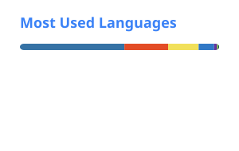

# Haoming Koo

**Applied AI Engineer**

Production LLM systems, RAG, agent workflows, and enterprise AI delivery | AI Singapore | Ex-Micron (contributed to USD 600M+ in program outcomes) | MSc NUS | Claude Certified Architect (Anthropic)

GitHub username: [`haomingkoo`](https://github.com/haomingkoo)

---

## What I'm Working On

- Building production ML systems at **AI Singapore (AIAP)** across vision, sequence modelling, NLP, and MLOps, including a 100E industry AI solution for complex operational planning
- Building **RAG, agent workflows, evals, and LLM observability** into practical AI products
- Maintaining [8 deployed public systems](https://kooexperience.com) across job search, travel intelligence, market research, weather, data triage, and source-backed tools
- Building open-source tools: [japan-seasons-mcp](https://github.com/haomingkoo/japan-seasons-mcp) - MCP server giving AI assistants live Japan travel data

Previously led global AI-enabled transformation at **Micron Technology** for 7 years, supporting cross-site programs across four fabs and contributing to USD 600M+ in program outcomes.

## Tech Stack

**ML & AI**\

**Web & APIs**\

**Infrastructure & MLOps**\

## Live Apps

| Project | Description | Stack |
|---------|-------------|-------|
| [**Job Hunter SG**](https://job.kooexperience.com) | Singapore job search product with RAG matching, ATS scoring, role-fit keyword checks, and fact-checked resume edits | React, FastAPI, SEA-LION, sentence-transformers |
| [**Trader Koo**](https://trader.kooexperience.com) | Market research dashboard with source-fresh data, evidence charts, paper-trade records, and Telegram alerts | FastAPI, React, LightGBM, YOLOv8 |
| [**Japan in Seasons**](https://seasons.kooexperience.com) | Japan seasonal travel map, REST API, and MCP server with 17 read-only tools and 1,700+ places | TypeScript, MCP SDK, Node HTTP, Zod |
| [**Amex Explorer**](https://amex-explorer.kooexperience.com) | Source-backed benefit explorer with maps, official data tracking, and stale-source alerts | Python, Playwright, GitHub Actions, Source Hashes |
| [**LionWeather**](https://lionweather.kooexperience.com) | Singapore weather app with live NEA ingestion, radar cache, saved locations, and LightGBM rainfall forecasts | React, FastAPI, LightGBM, NEA API |
| [**Photo Compliance Studio**](https://studio.kooexperience.com) | Passport/ID photo rules engine with face landmarks, segmentation, crop assistance, and country-profile checks | FastAPI, MediaPipe, OpenCV, rembg |
| [**Preflight**](https://preflight.kooexperience.com) | Dash workbench for CSV/Parquet uploads, EDA charts, baseline classifiers, and CV metrics | Dash, Plotly, scikit-learn, Pandas |
| [**MinMax Wine**](https://wine.kooexperience.com) | Wine deal engine with retailer scraping, bundle normalization, Vivino matching, and confidence-aware scoring | FastAPI, Selenium, SQLAlchemy, PostgreSQL |

## GitHub Stats

## Latest Blog Posts

**Building**
- [I Went from 64 to 100/100 on Smithery. Here's Every Fix.](https://kooexperience.com/blog/posts/create-mcp.html) - AI, MCP, TypeScript
- [PDF Parsing for Complaint Forms — Docling vs PyMuPDF vs PaddleOCR](https://kooexperience.com/blog/posts/pdf-parsing-comparison.html) - ML, OCR, Open Source
- [I Built an AI Wine Deal Finder — Here's What 50 Bottles Taught Me](https://kooexperience.com/blog/posts/minmax-wine.html) - AI, Full-Stack, Singapore
- [Building Job Hunter SG: AI Resume Coaching for Singapore](https://kooexperience.com/blog/posts/job-hunter.html) - AI, Full-Stack, Singapore
- [What Mood Is the Market In? An Interactive Guide to HMM Regime Detection](https://kooexperience.com/blog/posts/hmm-regime.html) - ML, Visualization, Trading
- [How 468 Facial Landmarks Decide If You're Passport-Ready](https://kooexperience.com/blog/posts/photo-id-studio.html) - Computer Vision, FastAPI, OpenCV
- [How I Built an AI-Powered Stock Market Dashboard](https://kooexperience.com/blog/posts/trader-koo.html) - YOLOv8, FastAPI, Computer Vision
- [I Tried to Predict Singapore's Rain and It Humbled Me](https://kooexperience.com/blog/posts/lionweather.html) - ML, FastAPI, EDA

**Research**
- [DPO Interactive Demo: Your Language Model is Secretly a Reward Model](https://kooexperience.com/blog/posts/dpo-demo.html) - ML, Alignment, Visualization
- [Visualizing Weak-Driven Learning: An Interactive WMSS Demo](https://kooexperience.com/blog/posts/wmss-demo.html) - ML, Visualization

**LLMOps**
- [What I Learned from a Live LLM Serving Gauntlet](https://kooexperience.com/blog/posts/llm-gauntlet.html) - vLLM, Part 2
- [LLM Inference: The Theory You Need Before Deploying](https://kooexperience.com/blog/posts/llm-inference-theory.html) - Inference, Part 1

## Connect

Open to conversations about applied AI, production LLM systems, RAG, agent workflows, evals, and practical AI product delivery.

- Website: [kooexperience.com](https://kooexperience.com)
- LinkedIn: [linkedin.com/in/haomingkoo](https://linkedin.com/in/haomingkoo)
- Email: [haomingkoo@gmail.com](mailto:haomingkoo@gmail.com)
